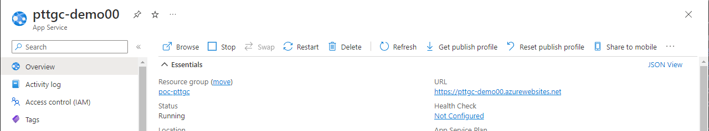

# Source code scanning

## PREREQUISITE
### Create Repository Secrets
`REGISTRY_LOGIN_SERVER`
`REGISTRY_USERNAME`
`REGISTRY_PASSWORD`

1. Login to Azure portal 

[Azure_Portal](https://azure.microsoft.com/en-us/get-started/azure-portal/)

2. Select Azure cloud Shell


3. First command to login to ACR. 
 
 ```console
 
export RESOURCE_GROUP="$(az group list --query "[?location=='eastasia']" | jq -r '.[0].name')"

 groupId=$(az group show \
   --name ${RESOURCE_GROUP} \
   --query id --output tsv)
 ```

4. Second command to login to ACR. create the service principal (Copy clientId and clientSecret please see detail in step 7.)
 
  ```console
 az ad sp create-for-rbac \
  --scope $groupId \
  --role Contributor \
  --sdk-auth
  ```
 
 

5. Third command to login to ACR. Please change <registry-name> to your registry name from step 4.
 
 ```console
 export REPO_NAME="$(az acr list | jq -r '.[].name')"
 ```

```console
 registryId=$(az acr show \
   --name ${REPO_NAME} \
   --query id --output tsv)
 ```
   
 
6. Fourth command to login to ACR. Please change <ClientId> to your clientId or app id from step 4. And please keep the result.

  ```console
 az role assignment create \
  --assignee <ClientId> \
  --scope $registryId \
  --role AcrPush
  ```
 

 
7. Get `REGISTRY_LOGIN_SERVER`
 
   ```console
   az acr list | jq -r '.[].loginServer'
   ```
 
8. Create Github Repo.

 In the GitHub UI, navigate to your forked repository and select Settings > Secrets > Actions and Select New repository secret to add the following secrets:


Reference : https://docs.microsoft.com/en-us/azure/container-instances/container-instances-github-action

---

## Exercise 1
### Deploy to Dev Slot
1. Login to Azure Portal, goto `App Services` then select the App service from the list
2. Add `dev` slot, go to `Deployment slots` then click `Add slot`, set name as `dev` and clone the setting fromt an existing one

3. Click on deployment slot `dev` and then Go to `Overview` menu and click `Get publish profile` to download the publish profile



4. Create Secret name `AZURE_WEBAPP_PUBLISH_PROFILE_DEV` with the content from file that download
from step 2
5. Add another jobs to deploy to dev slot
```yaml
deploy-dev:
    name: Deploy to Dev Slot
    runs-on: ubuntu-latest
    needs: containerized

    steps:
      - name: deploy dev slot
        uses: azure/webapps-deploy@v2
        with:
          #app-name: 'pttgc-simple-app'
          app-name: 'pttgc-demo007'
          # Add publish profile from secret that created from publish profile which we downloaded from Azure Portal
          publish-profile: ${{ secrets.AZURE_WEBAPP_PUBLISH_PROFILE_DEV }}
          slot-name: dev
          images:  ${{ secrets.REGISTRY_LOGIN_SERVER }}/simple-service:${{ github.sha }}
```
6. Commit and push the code, and see how the workflow is running
7. Login to Azure portal, App Service then select `dev` slot, and see the image tag from `Deployment Center`


## Exercise 2
### Deploy to production slot

#### Pre-requisits
- Download the publish profile from deployment slot `production` and use its content to create secrets name `AZURE_WEBAPP_PUBLISH_PROFILE`

1. Create new workflow file name `production-release.yaml`
```yaml
name: Production Release and Deploy

on: 
  release:
    types:
      - published
    branches:
      - main

jobs:
  
  retag-image:
    name: Retag release image
    runs-on: ubuntu-latest
    steps:
      - uses: azure/docker-login@v1
        with:
          login-server: ${{ secrets.REGISTRY_LOGIN_SERVER }}
          username: ${{ secrets.REGISTRY_USERNAME }}
          password: ${{ secrets.REGISTRY_PASSWORD }}
      - name: Get the version
        id: get_version
        run: echo ::set-output name=VERSION::$(echo $GITHUB_REF | cut -d / -f 3)

      - run: echo "Retag image from tag ${{ github.sha }} to ${{ steps.get_version.outputs.VERSION }}"
      - run: docker pull ${{ secrets.REGISTRY_LOGIN_SERVER }}/simple-service:${{ github.sha }}
      - run: docker tag ${{ secrets.REGISTRY_LOGIN_SERVER }}/simple-service:${{ github.sha }} ${{ secrets.REGISTRY_LOGIN_SERVER }}/simple-service:${{ steps.get_version.outputs.VERSION }}
      - run: docker push ${{ secrets.REGISTRY_LOGIN_SERVER }}/simple-service:${{ steps.get_version.outputs.VERSION }}

  deploy: 
    name: Deploy to App Service Production
    runs-on: ubuntu-latest
    needs: retag-image
    steps:
      - name: Get the version
        id: get_version
        run: echo ::set-output name=VERSION::$(echo $GITHUB_REF | cut -d / -f 3)
      - name: deploy production slot
        uses: azure/webapps-deploy@v2
        with:
          # This value should match with the name of your app service (it could be difference from this example)
          app-name: 'pttgc-simple-app'
          # Add publish profile from secret that created from publish profile which we downloaded from Azure Portal
          publish-profile: ${{ secrets.AZURE_WEBAPP_PUBLISH_PROFILE }}
          # slot-name, default value is production, we can ignore this line, however for the readability purpose, we should keep it as best practice
          slot-name: production
          images:  ${{ secrets.REGISTRY_LOGIN_SERVER }}/simple-service:${{ steps.get_version.outputs.VERSION }}
```

2. Commit and Push the code
3. Wait until the `build` workflow success and then continue step 4
4. Create new release with tag version `v1.0.0`, then click create release
5. Go to `Actions` to see the progress of the `production-release` workflow
6. Wait until the workflow is done, then go to the Azure Portal, on the production slow, check the image that deployed from `Deployment Center`
